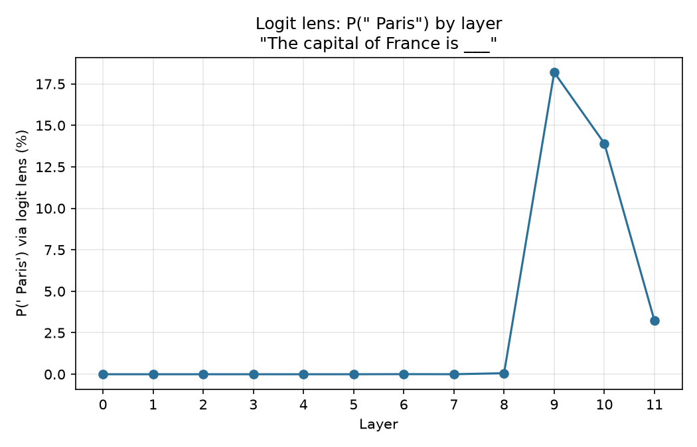
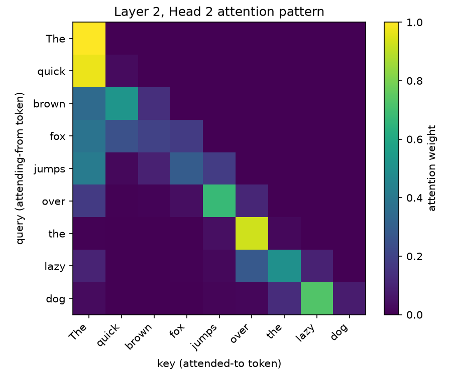

# transformer-lens-lab

A from-scratch toolkit for looking *inside* a small transformer language model — not just calling it, but watching how it computes its answer.

Most portfolio projects call an LLM API and build a product on top. This one goes the other direction: it opens up an open-weight model (GPT-2 small, 124M params) and asks *how does it actually work internally?* using techniques from the mechanistic interpretability research field (Anthropic, EleutherAI, Neel Nanda's work).

## Why this exists

Anyone can wrap an OpenAI API call. Understanding what happens inside the 12 transformer blocks between input tokens and output logits is a different skill — and it's the kind of understanding that separates "I use LLMs" from "I understand LLMs."

## What's in here

| Module | What it does | Status |
|---|---|---|
| `tlab.model` | Loads GPT-2 small via HuggingFace, exposes clean internals | ✅ |
| `tlab.hooks` | PyTorch forward hooks to capture activations at any layer | ✅ |
| `tlab.attention_viz` | Visualizes attention patterns per head/layer | ✅ |
| `tlab.logit_lens` | Decodes intermediate residual stream states into vocabulary space | ✅ |
| `tlab.patching` | Activation patching for causal attribution ("which layer caused this output?") | ✅ |
| `tlab.app` | Interactive Streamlit demo tying the above together | ✅ |

Each module ships with a short writeup in `docs/` explaining *what we found*, not just what the code does.

## Findings so far

- **Layer 9 causally carries the France→Paris association** — activation
  patching (a real intervention, not just observation) shows patching layer
  9's residual stream alone recovers 62.5% of the gap between a corrupted
  and clean prompt's confidence in " Paris"; layers 0–8 recover essentially
  nothing:

  

  [Full writeup](docs/05_activation_patching.md) — the project's headline result, and the one place a causal claim (not just a correlational one) is actually justified.

- **GPT-2 "considers" the correct answer, then partially backs away from it.**
  For `"The capital of France is ___"`, the logit lens shows `" Paris"` jumping
  from ~0% to 18% probability (rank 2) at layer 9 — then *dropping back* to
  3% (rank 5) by the final layer, which is what the model actually outputs:

  

  [Full writeup](docs/04_logit_lens_paris.md) — activation patching above independently confirms layer 9 is where this originates, not just correlates.

- **The residual stream grows ~8x in norm across 12 layers**, accelerating sharply
  in the final layers — [full writeup](docs/02_residual_stream_growth.md).
- **GPT-2 small has genuine "previous-token heads"** — attention heads that
  reliably copy from exactly one position back, a documented circuit primitive:

  

  [Full writeup, including a methodological caveat about over-counting "sink" heads on short prompts](docs/03_attention_patterns.md).

## Setup

```bash
python3.11 -m venv .venv
source .venv/bin/activate
pip install -e ".[dev]"
```

## Interactive demo

Type any prompt and see attention patterns and the logit lens trajectory update live:

```bash
pip install -e ".[app]"
streamlit run src/tlab/app.py --server.fileWatcherType none
```

`--server.fileWatcherType none` avoids a known crash: `transformers` ships
optional vision-model submodules (e.g. ZoeDepth) that import `torchvision`
lazily, and Streamlit's default file watcher eagerly walks every imported
module's path on each file change, triggering that import even though this
project never uses those submodules. Since the demo's code isn't being
hot-edited during a session, disabling the watcher sidesteps the issue.

## Background reading this project is built on

- Anthropic, [A Mathematical Framework for Transformer Circuits](https://transformer-circuits.pub/2021/framework/index.html)
- Neel Nanda, [TransformerLens](https://github.com/TransformerLensOrg/TransformerLens) (this project is intentionally *not* using that library — building the mechanics by hand is the point)
- nostalgebraist, [logit lens](https://www.lesswrong.com/posts/AcKRB8wDpdaN6v6ru/interpreting-gpt-the-logit-lens)

## License

MIT
