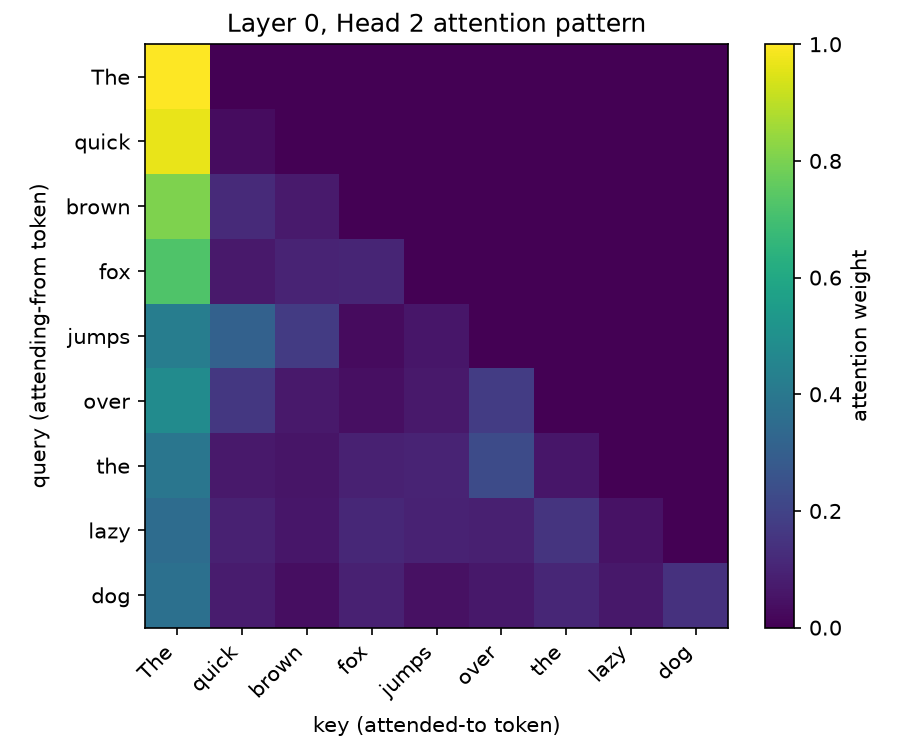

# Finding: GPT-2 small's attention is dominated by "sink" heads, not content-matching

**Setup:** prompt `"The quick brown fox jumps over the lazy dog"` (9 tokens), all
132 layer/head attention patterns captured and scanned for two archetypes.
Code: `notebooks/03_attention_patterns.py`, detectors in `tlab/attention_viz.py`.

## Result

- **Attention-sink heads** (>50% average weight on token 0, `"The"`): **~100 of 132**
  heads, essentially every head from layer 3 onward.
- **Previous-token heads** (>50% average weight on the immediately preceding token):
  2 heads found — layer 2/head 2, layer 4/head 11.

## Interpretation

The sink-head count is striking, but likely overstates "meaningful" sink behavior —
with only 9 tokens and a causal mask, early positions have very few valid keys to
choose from (token 1 can only attend to token 0 and itself), which mechanically
inflates weight on token 0 regardless of whether the head is doing anything
semantically interesting there. **A fairer test would use a longer sequence**
(50+ tokens) so early-position mechanical effects wash out — flagged as a
follow-up rather than treated as a clean result here.

The previous-token heads, by contrast, show a genuinely clean, sequence-length-independent
signature: a bright cell exactly one column left of the diagonal, for every query
position beyond the first two tokens. That's a real, well-formed circuit component,
consistent with prior published findings (Anthropic's Transformer Circuits work) —
not an artifact of this particular short prompt.

## Methodological note

This is the first result in the project that came with a caveat attached rather
than being taken at face value — worth flagging explicitly, since over-trusting a
threshold-based detector on a too-short input is a realistic failure mode in
interpretability work generally, not just here.

## Follow-up

- Re-run `find_first_token_heads` on a 50+ token prompt and see how much the count drops.
- Once `logit_lens.py` exists, check whether the previous-token heads at layer 2
  causally matter for next-token prediction, or are redundant with later layers.
