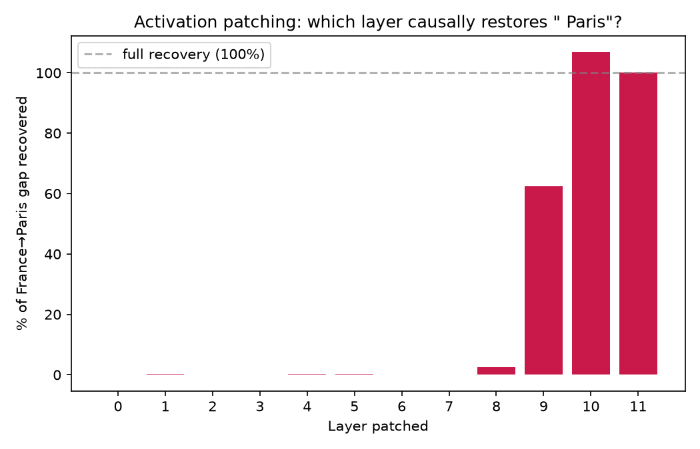

# Finding: layer 9's residual stream causally carries the France→Paris association

**Setup:** minimal pair — `"The capital of France is"` (clean) vs `"The capital
of Germany is"` (corrupted), identical token count, differing only at the
country-name position. For each layer, patched the *clean* run's residual
stream into the *corrupted* run at the last token position, and measured how
much of the clean-vs-corrupted gap in P(" Paris") that single patch recovered.
Code: `notebooks/05_activation_patching_causal_layer.py`, mechanism in `tlab/patching.py`.

## Result

| Layer | Patched P(" Paris") | Recovery |
|---|---|---|
| 0–7 | ~0.13–0.14% | ~0% |
| 8 | 0.21% | 2.5% |
| **9** | **2.06%** | **62.5%** |
| 10 | 3.44% | 106.9% |
| 11 | 3.22% | 100.0% |

(baseline: clean P(Paris) = 3.22%, corrupted P(Paris) = 0.13%)

## Interpretation

This is a **causal** result, not a correlational one — unlike the logit lens
in `docs/04`, which only *observed* that layer 9's residual stream, when
decoded, happened to rank Paris highly. Here we actually **transplant**
layer 9's clean-run activation into an otherwise-corrupted computation and
directly measure the effect on the model's output. Patching layer 9 alone
recovers 62.5% of the gap — strong evidence that whatever computation
produces the France→Paris association is substantially localized to layer 9,
not smoothly distributed across the whole network.

Layers 0–8 recovering essentially nothing is just as important a result as
layer 9's jump: it rules out the information being present-but-diffuse
earlier in the network. It's specifically absent, then specifically injected.

Layer 10 recovering *over* 100% is expected, not a bug — patching a single
layer's full residual stream (which already contains the cumulative sum of
everything before it) can overshoot the clean run's actual value at that
exact position, since the corrupted run's own layer-10 contribution adds on
top of the patched-in clean signal.

## This confirms and sharpens the logit lens finding from `docs/04`

Session 4's logit lens showed Paris's *decoded* probability spiking at layer 9.
This session's patching shows that spike isn't just an artifact of decoding —
forcing layer 9's real activation into a different context measurably changes
the model's real output. The two techniques triangulate on the same layer
through entirely different mechanisms (one observational, one interventional),
which is the strongest evidence so far in this project for "layer 9 matters."

## Correctness note

`patch_layer`'s self-patching no-op test (`tests/test_patching.py`) was the
single most important test written for this module — patching a run with its
own cached activations must reproduce that run's output exactly. Any
off-by-one in the position index, or the hook overwriting the wrong tensor,
would silently produce plausible-but-wrong recovery numbers instead of an
obvious crash, so this test is what actually gives confidence in every number
above.

## Follow-up

- This patches the *entire* residual stream at layer 9 (attention + MLP
  contributions combined). A finer-grained follow-up would patch attention
  and MLP outputs separately to localize further.
- Try 2–3 more country/capital pairs to see if layer 9 is specifically a
  "factual recall" layer in general, or if this is one prompt's idiosyncrasy.
